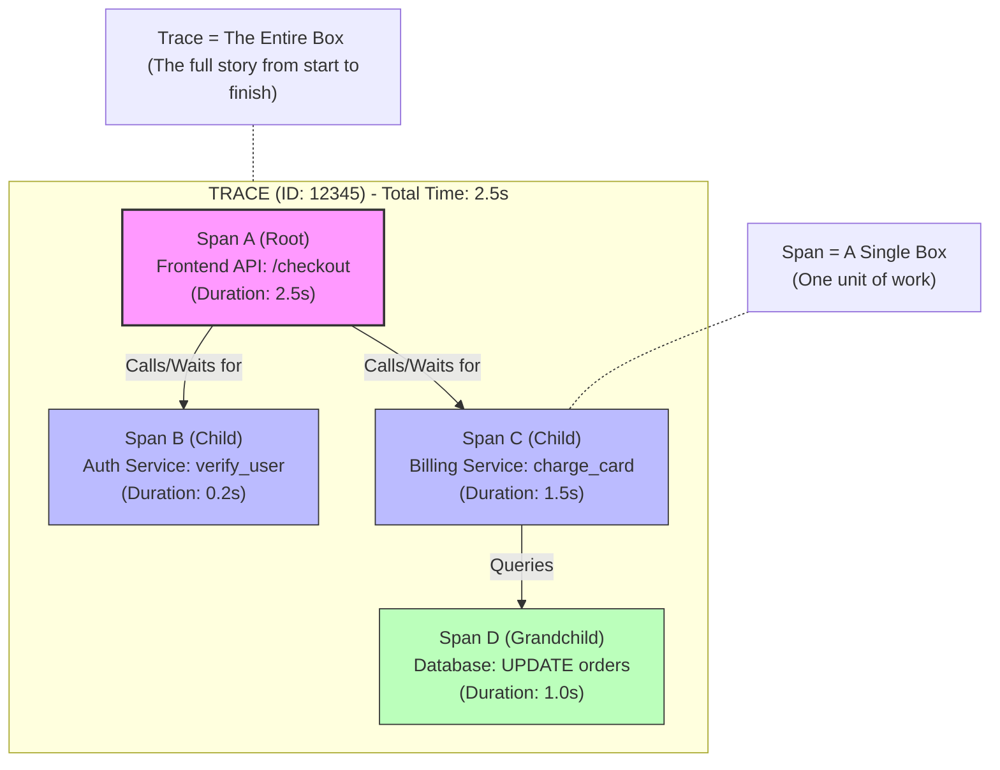
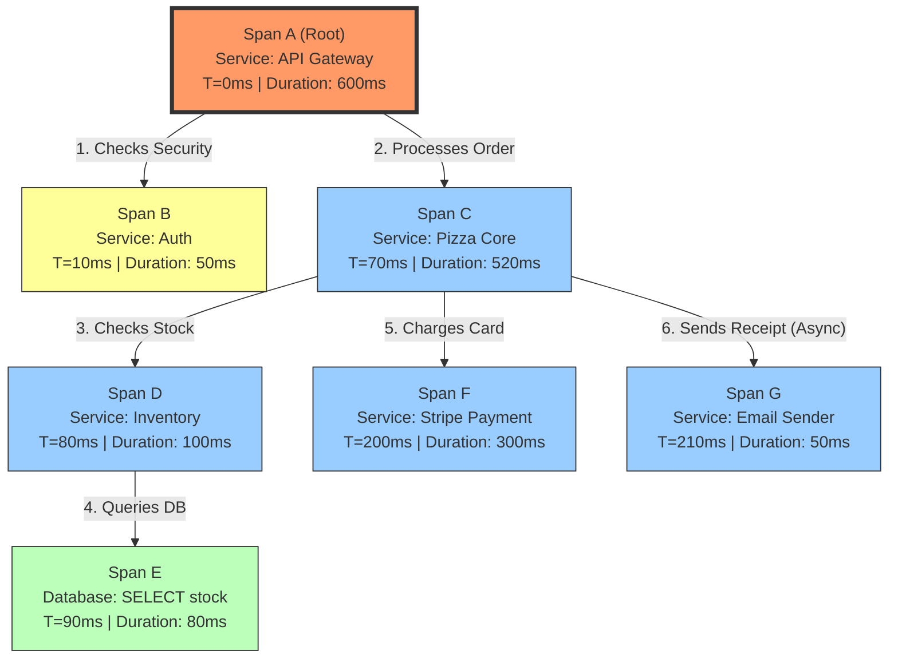

Hello! I am your **Super Teacher**.

Here is a diagram representing the relationship between a **Trace** and a **Span**.

Think of a **Trace** as the "Whole Book" (the entire journey of the request), and a **Span** as a "Single Chapter" (one specific job done by one specific service).

### Explanation of the Diagram

*   **The Outer Box (The Trace)**:
    *   This represents the **Trace**. It tracks the request from the moment the user clicked "Buy" until the "Success" message appeared.
    *   It has a single ID (`12345`) that ties everything together.
*   **The Inner Boxes (The Spans)**:
    *   **Span A (Frontend)**: This is the "Parent." It cannot finish until its children finish.
    *   **Span B (Auth)**: A quick check. It finishes fast.
    *   **Span C (Billing)**: This takes a long time.
    *   **Span D (Database)**: This is a child of Billing. Billing cannot finish until the Database confirms the money is moved.
*   **The Insight**:
    *   If the **Trace** takes 2.5 seconds, looking at this diagram tells you that **Span C (Billing)** and **Span D (Database)** are the problem areas. You don't need to waste time fixing Span B (Auth).

     
     
     
     
     

    Hello! I am your **Super Teacher**.

To understand the **order** of spans (which happens first, which happens next), you have to look at two things:
1.  **Hierarchy (Parent/Child)**: A parent cannot finish until all its children are done.
2.  **Timestamps (Start Time)**: If two spans are siblings (children of the same parent), the timestamps tell you if they happened one after another (Sequential) or at the same time (Parallel).

Here is a complex example: **Ordering a Pizza via a Mobile App**.

### The Scenario: "The Pizza Trace"
1.  **User** clicks order.
2.  **API Gateway** receives it.
3.  **API Gateway** checks **Auth** (Security).
4.  **API Gateway** sends to **Order Service**.
5.  **Order Service** checks **Inventory** (Do we have dough?).
6.  **Order Service** charges the **Payment** (Money).
7.  **Order Service** sends an **Email** (Receipt).

### The Mermaid Diagram

Notice the **Start Times** (T=...) and **Durations** in the boxes. This is how you tell the order.

---

### How to Read the Order (The Logic)

If you look at this trace in a tool like **Jaeger** or **Datadog**, here is how you determine the order:

**1. Look at the Hierarchy (The Tree)**
*   **Logic**: `Span A` is the parent. `Span B` and `Span C` are children.
*   **Rule**: The Parent starts **before** the children and finishes **after** the children.
    *   *Evidence*: The API Gateway (A) starts at T=0ms and is the last thing to finish at 600ms.

**2. Look at Sequential Siblings (One after another)**
*   **Logic**: Look at `Span B (Auth)` and `Span C (Pizza Core)`.
*   **Rule**: Check the timestamps.
    *   `Span B` ends at T=60ms (10ms start + 50ms duration).
    *   `Span C` starts at T=70ms.
    *   **Conclusion**: Since C starts *after* B finishes, this is **Sequential**. The Gateway waited for security to pass before trying to order the pizza.

**3. Look at Parallel Siblings (At the same time)**
*   **Logic**: Look at `Span F (Payment)` and `Span G (Email)`.
*   **Rule**: Check the timestamps.
    *   `Span F` starts at T=200ms.
    *   `Span G` starts at T=210ms.
    *   **Conclusion**: They are running **at the same time**. The `Pizza Core` service started the payment, and while waiting for the bank, it immediately sent the email. It didn't wait for the payment to finish before sending the email.

### Technical Note: How the Computer Knows
In the code, every span has three IDs that create this structure:
*   **Trace ID**: `12345` (Shared by everyone in the diagram).
*   **Span ID**: `Unique-ID-For-Me`.
*   **Parent ID**: `ID-Of-Who-Called-Me`.

*   `Span E (Database)` knows its place because its **Parent ID** points to `Span D (Inventory)`.
*   `Span D (Inventory)` knows its place because its **Parent ID** points to `Span C (Pizza Core)`.